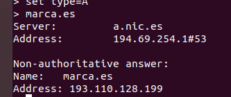

# Petición recursiva con el comando nslookup

Primero, ¿Qué diferencia hay entre una petición recursiva e iterativa?
- La solicitud de una búsqueda recursiva hace solicitudes sucesivas de la dirección IP al dominio y si no la obtiene, realiza nuevas solicitudes hasta encontrarla y la solicitud de búsqueda iterativa realiza una búsqueda en la base de datos de la dirección IP relacionada con el nombre de dominio, si no la obtiene pregunta al dominio donde realizar la próxima búsqueda.

-Aquí hay una representación mediante un esquema

# Como usar una petición recursiva mediante el comando nslookup
-Primero haciendo usos de los servidores raiz en este caso a.root-server.net, iniciaremos una petición recursiva a la página del marca.es

-Y después veréis que funciona

